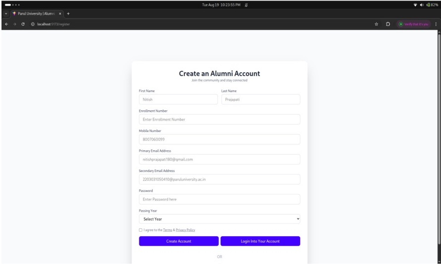
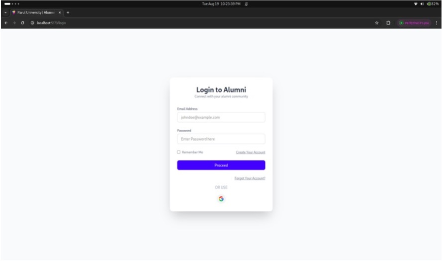
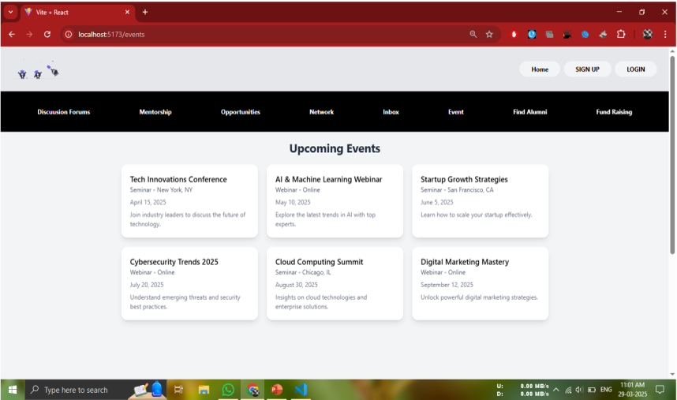
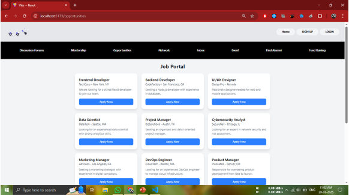
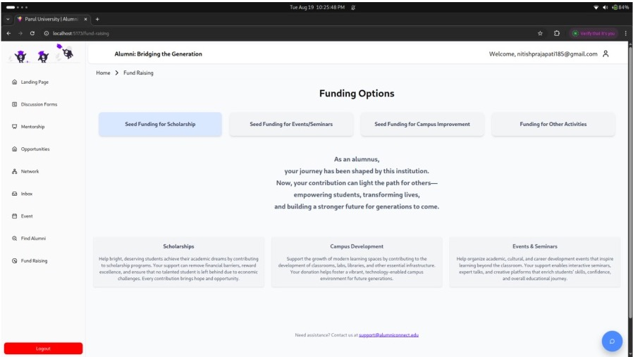
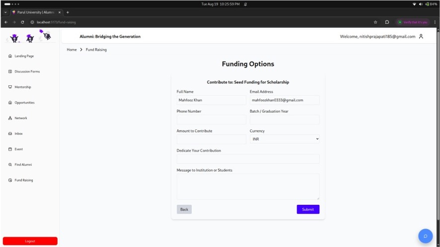
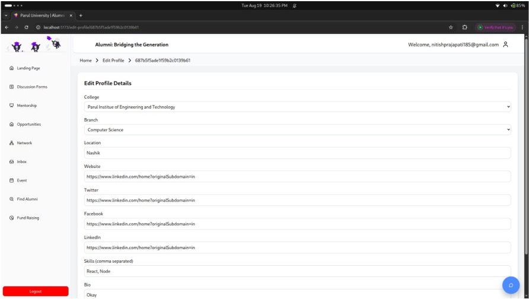

# 🎓 Alumni Connect – Bridging the Generations

Alumni Connect is a web-based **Alumni Engagement and Support Platform** that connects universities, alumni, and students to enable mentorship, networking, career guidance, events, fundraising, and secure alumni verification.

---

## 📖 About the Project

Alumni networks are often underutilized, creating a gap between alumni and students. Students struggle to find mentorship and career guidance, while alumni lack a structured platform to contribute their experience.

**Alumni Connect** bridges this gap through a secure, interactive, and AI-powered platform.

---

## 🎯 Aim

To create a verified and dynamic alumni–student collaboration system that supports knowledge sharing and career growth.

---

## ✅ Objectives

- Enhance alumni–student engagement  
- Provide academic and career guidance  
- Enable alumni contributions (mentorship, events, funding)  
- Ensure authenticity and data security  
- Encourage professional networking  

---

## 🚀 Features

- 🔐 Verified Alumni Registration & Login  
- 💬 Discussion Forums  
- 🤝 Mentorship Programs  
- 💼 Job & Internship Portal  
- 📅 Events & Webinars  
- 💰 Fundraising & Donations  
- 👤 Profile Management  
- 🤖 AI Chatbot Support  

---

## 🛠️ Methodology

This project follows the **Scrum (Agile) Model**:
1. Requirement Analysis  
2. System Design  
3. Iterative Development  
4. Testing & Debugging  
5. Deployment & Maintenance  

---

## 🧩 Modules

- Registration & Login  
- Dashboard  
- Opportunities / Job Portal  
- Events  
- Discussion Forums  
- Mentorship  
- Fundraising  
- Profile Management  
- AI Chatbot  

---

## 📸 Screenshots

### Registration Page

### Login Page

### Events Page

### Job & Opportunities Portal

### Fund Raising Options

### Fund Raising Form

### Edit Profile Page

---

## 🔐 Security

- Verified user accounts  
- Secure authentication  
- Data privacy protection  

---

## 👨‍💻 Team Members

- Nitish Mahendra Prajapati  
- Mahfooz Khan  
- **Piyush Bagadi**  
- Gaurav Kumar  

### 🎓 Project Guide
**Dr. Saurabh Shah**  
Professor & Director of Talent & Career Development

---

## 🏁 Conclusion

Alumni Connect provides a modern, secure, and AI-enabled solution to strengthen alumni engagement and support student career development.
